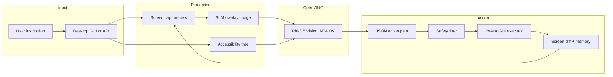

# OpenVINO GUI Agent

A cross-platform desktop GUI agent powered by a local Vision-Language Model (Phi-3.5 Vision INT4 via OpenVINO). The agent observes the screen, reasons about it, and executes real OS-level actions to complete user instructions.

## Architecture

End-to-end data flow (device and model are configurable in `config.py`; default model path is under `models/`):



**Perception → Planning → Action → Feedback** (same pipeline in prose):

| Stage | Component |
|-------|-----------|
| Capture | `vision/screen_capture.py` (mss) |
| Accessibility | `agent/screen_analyzer.py` + `agent/platform/*` |
| Grounding | `vision/som_overlay.py` (numbered badges) |
| Planning | `vision/vlm_inference.py` + `agent/planner.py` (OpenVINO VLM → JSON) |
| Safety | `agent/safety.py` |
| Execution | `agent/executor.py` (PyAutoGUI + fallbacks) |
| Feedback | Screen diff, short-term memory, reflection hints on failure (`agent/controller.py`) |

See **[docs/MODEL_ROLES.md](docs/MODEL_ROLES.md)** for why a **single** VLM handles both perception and plan JSON today.

## What you can do (user-visible)

Typical tasks the agent is **designed** to attempt (success depends on OS, apps, and model behavior):

1. **Open applications** by name via search/Start menu flows (e.g. “open Calculator”).
2. **Click** numbered controls using Set-of-Marks + accessibility grounding.
3. **Type text** into focused fields or element-targeted inputs.
4. **Press keys / hotkeys** where allowed by the safety layer (dangerous combos blocked).
5. **Scroll** and **wait** as intermediate steps in a multi-step instruction.
6. **Run multi-step instructions** until done or iteration limit — each step is one VLM call plus one executed action.
7. **Observe progress** in the 3-panel UI: live SoM view, thought, JSON plan, execution result.
8. **Stop safely** with the Stop button or PyAutoGUI failsafe (mouse to top-left corner when enabled).
9. **Use CLI or HTTP API** for the same loop without the full GUI (`cli_agent.py`, `main.py`).
10. **Inspect runs** with optional debug artifacts under `debug_screenshots/` when `DEBUG_MODE` is on.

## Limitations (honest scope)

- **Multi-monitor:** primary capture / focus assumptions may mis-target windows on secondary displays.
- **Elevated or protected UIs:** admin prompts, secure desktop, and some fullscreen apps may block automation.
- **Games / GPU-exclusive fullscreen / DRM:** generally unsuitable; not a focus of this prototype.
- **Heavy or slow VLM:** real-time gaming-style control is unrealistic; latency is model- and device-dependent.
- **Locale and layout:** UI text and control positions change with language, theme, and DPI scaling.
- **Single action per VLM step:** the planner returns one action per iteration to keep behavior traceable.
- **Safety blocks:** some system shells and dangerous patterns are intentionally rejected.

## Documentation map

| Doc | Purpose |
|-----|---------|
| [scenarios/SCENARIOS.md](scenarios/SCENARIOS.md) | 3–5 reproducible scenarios, pass criteria, **test run record** template |
| [docs/BENCHMARKS.md](docs/BENCHMARKS.md) | How to measure latency/memory and **record** benchmark runs |
| [docs/DEMO_RECORDING.md](docs/DEMO_RECORDING.md) | Step-by-step **screen recording** checklist (OpenVINO visible) |
| [docs/MODEL_ROLES.md](docs/MODEL_ROLES.md) | Single VLM vs optional future planner LLM |

## Features

- **Cross-platform**: Windows, Linux, macOS accessibility backends
- **Local inference**: Phi-3.5 Vision via OpenVINO on `CPU`, `GPU`, or `AUTO` (`OPENVINO_DEVICE` in `config.py`; no cloud API required)
- **Observable**: 3-panel UI shows live screen, agent reasoning, and control metrics
- **Safety system**: Blocks dangerous commands (rm -rf, format, shutdown), hotkeys (Alt+F4), and executables (powershell, cmd)
- **Structured errors**: Every error is categorized (model/execution/os/grounding/safety) with recovery info
- **Fallback strategies**: Element click -> coordinate fallback -> keyboard navigation
- **Debug mode**: Saves raw/annotated screenshots, JSON plans, and action logs per iteration

## Quick Start

### 1. Install dependencies

```bash
pip install -r requirements.txt
```

### 2. Download the model

```bash
huggingface-cli download OpenVINO/Phi-3.5-vision-instruct-int4-ov --local-dir models/Phi-3.5-vision-instruct-int4-ov
```

### 3. Launch

**Desktop GUI** (recommended):
```bash
python gui_app.py
```

**API server**:
```bash
python main.py
# Then send tasks via HTTP:
curl -X POST http://localhost:8000/run-task -H "Content-Type: application/json" -d '{"instruction": "open calculator"}'
```

**CLI client**:
```bash
python cli_agent.py "open calculator and compute 42 x 7"
```

## UI Layout

| Panel | Content |
|-------|---------|
| **Left** | Instruction input, Run/Stop buttons, iteration counter, status, token usage, speed, UI element count, debug toggle |
| **Center** | Live screenshot stream with Set-of-Marks overlay and target element highlighting |
| **Right** | Per-iteration reasoning: Thought, Action Plan (JSON), Executed action, Result, Errors |

## Project Structure

```
OpenVINO GUI-Agent/
├── main.py                    # FastAPI server entry point
├── cli_agent.py               # CLI client
├── gui_app.py                 # PySide6 3-panel desktop UI
├── config.py                  # All tunables (model path, limits, delays)
├── agent/
│   ├── controller.py          # ReAct loop orchestrator
│   ├── planner.py             # VLM -> JSON action plan parser
│   ├── executor.py            # PyAutoGUI execution with fallbacks
│   ├── screen_analyzer.py     # Platform-dispatching accessibility extraction
│   ├── safety.py              # Dangerous action blocking
│   ├── errors.py              # Structured error categories
│   ├── os_actions.py          # Cross-platform OS actions (open_app, etc.)
│   └── platform/
│       ├── __init__.py         # Auto-detects OS, returns correct backend
│       ├── windows.py          # pywinauto UIA backend
│       ├── linux.py            # AT-SPI backend
│       └── macos.py            # AXUIElement backend
├── api/
│   └── server.py              # FastAPI REST endpoint
├── models/
│   └── action_schema.py       # Pydantic action/plan schemas
├── vision/
│   ├── vlm_inference.py       # OpenVINO model loading and inference
│   ├── screen_capture.py      # mss screen capture + downscaling
│   └── som_overlay.py         # Set-of-Marks badge drawing
├── utils/
│   └── logger.py              # Shared logging
├── docs/
│   ├── BENCHMARKS.md         # Latency/memory methodology
│   ├── DEMO_RECORDING.md     # Demo video checklist
│   └── MODEL_ROLES.md        # VLM vs planner LLM
├── scenarios/
│   └── SCENARIOS.md           # Reproducible evaluation scenarios
├── tests/
│   ├── test_planner.py        # JSON parsing tests (12 cases)
│   ├── test_executor.py       # Element resolution + safety tests
│   ├── test_safety.py         # Dangerous action blocking tests (13 cases)
│   ├── test_screen_analyzer.py # UIElement + builder tests
│   └── test_errors.py         # Error categorization tests
└── requirements.txt
```

## Action Types

| Type | Fields | Description |
|------|--------|-------------|
| `click` | `element` or `x, y` | Click a UI element or coordinate |
| `double_click` | `element` or `x, y` | Double-click |
| `type` | `text`, optional `element` | Type text into an input |
| `scroll` | `amount` | Scroll (positive=up, negative=down) |
| `wait` | `seconds` | Pause execution |
| `press_key` | `key` | Press a single key (enter, tab, escape, etc.) |
| `hotkey` | `keys` | Key combination (e.g. ctrl+c) |

## Safety

- **PyAutoGUI failsafe**: Move mouse to top-left corner to abort
- **Global Stop button**: Immediately halts the agent loop
- **Dangerous command detection**: Blocks rm -rf, format, shutdown, del /s, etc.
- **Dangerous hotkey detection**: Blocks Alt+F4, Ctrl+Alt+Delete
- **Executable blocking**: Blocks powershell, cmd, bash, wscript, etc.
- **Action limit**: Configurable cap per iteration (default: 10)

## Configuration

All tunables are in `config.py`:

| Setting | Default | Description |
|---------|---------|-------------|
| `OPENVINO_DEVICE` | `CPU` | OpenVINO device (CPU, GPU, AUTO) |
| `MAX_ITERATIONS` | `10` | Maximum steps per task |
| `MAX_NEW_TOKENS` | `300` | VLM generation limit |
| `STEP_DELAY_SECONDS` | `1.5` | Pause between iterations |
| `MEMORY_SIZE` | `5` | Steps kept in short-term memory |
| `SCREEN_CHANGE_THRESHOLD` | `0.02` | Minimum diff to detect screen change |
| `DEBUG_MODE` | `True` | Save debug artifacts per step |
| `BLOCK_DANGEROUS_ACTIONS` | `True` | Enable safety system |

## Platform Requirements

| OS | Accessibility Backend | Install |
|----|----------------------|---------|
| Windows | pywinauto (UIA) | `pip install pywinauto` (included in requirements.txt) |
| Linux | AT-SPI (pyatspi) | `sudo apt install python3-pyatspi` |
| macOS | AXUIElement | `pip install pyobjc-framework-ApplicationServices pyobjc-framework-Quartz pyobjc-framework-Cocoa` |

## Running tests

**Automated (required after code changes):**

```bash
python -m pytest tests/ -v
```

**How to record that you ran tests**

1. Run the command above from the repository root.
2. Copy the final summary line (e.g. `X passed`) into your PR or notes.
3. Optional: `python -m pytest tests/ -v --tb=short > test_run_log.txt` and attach `test_run_log.txt`.

**Manual / scenario testing**

1. Pick a scenario in [scenarios/SCENARIOS.md](scenarios/SCENARIOS.md).
2. Follow **How to run a scenario test** in that file.
3. Fill the **Test run record** template at the bottom of `scenarios/SCENARIOS.md` for each run.

**Benchmark / demo**

- Benchmark procedure: [docs/BENCHMARKS.md](docs/BENCHMARKS.md).
- Demo recording: [docs/DEMO_RECORDING.md](docs/DEMO_RECORDING.md).

## Debug Output

When `DEBUG_MODE = True`, each iteration saves to `debug_screenshots/`:
- `step_N_raw.png` -- raw screenshot
- `step_N_som.png` -- annotated screenshot with SoM overlay
- `step_N_plan.json` -- VLM action plan
- `step_N_actions.json` -- executed actions and results
